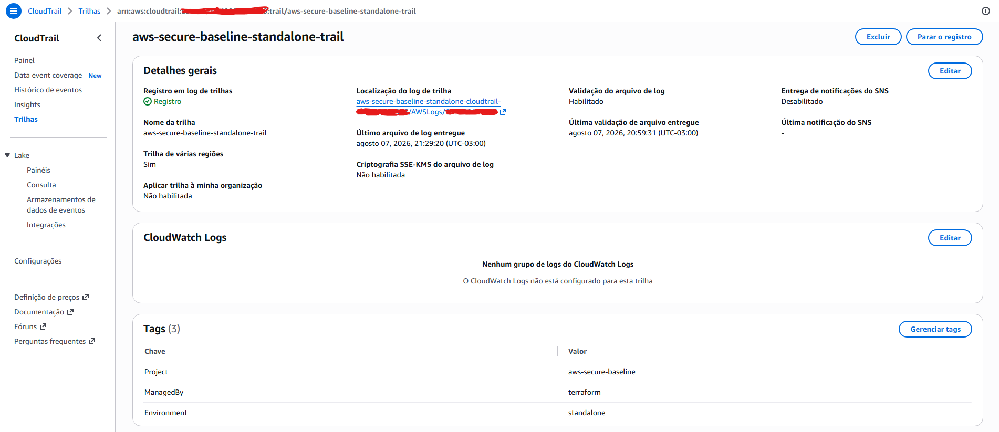
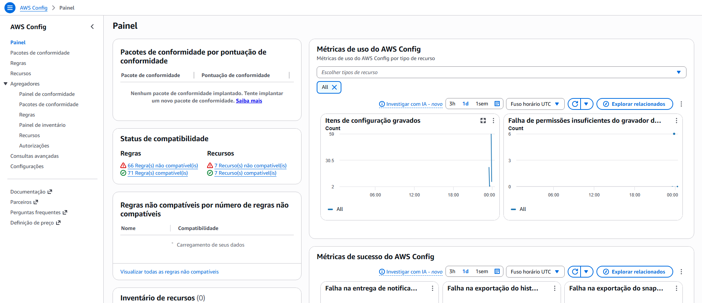
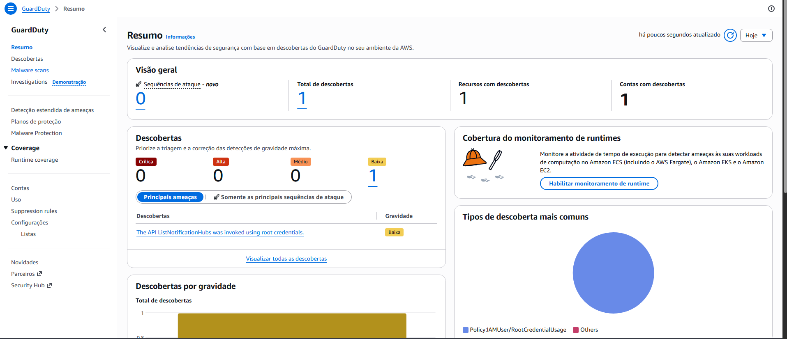
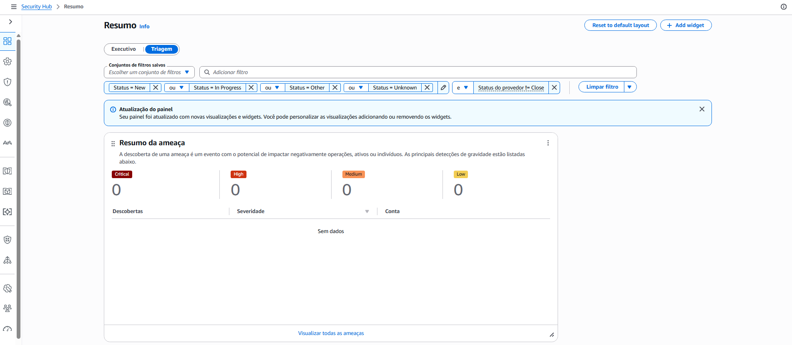
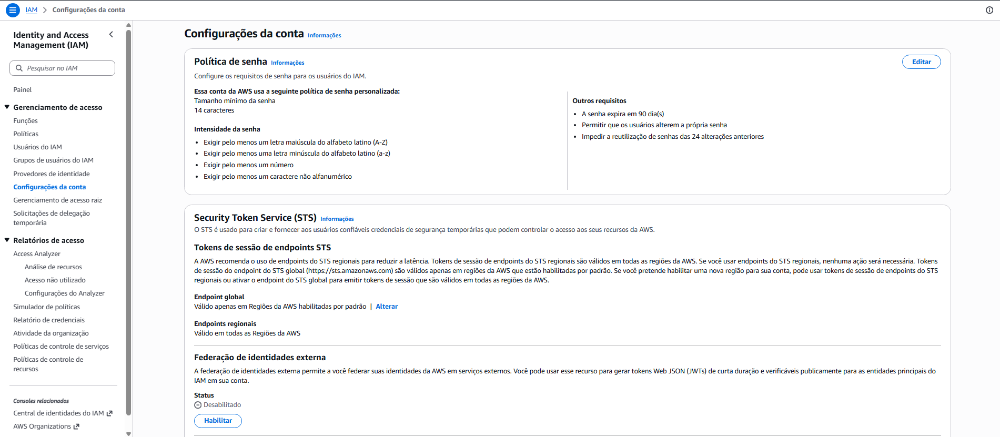
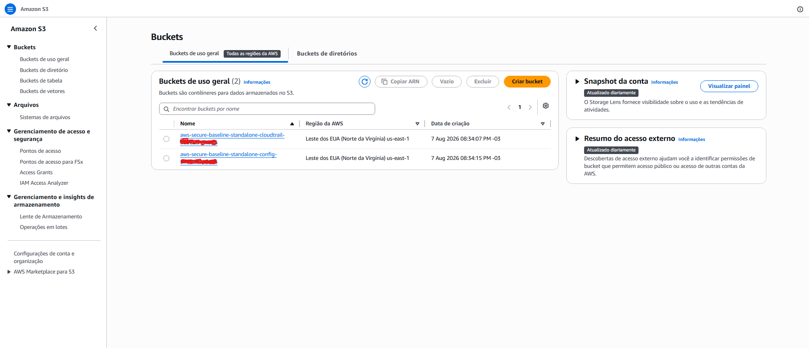

# AWS Secure Baseline

Repositório de hardening de contas AWS via Infrastructure as Code (Terraform), construído para portfólio DevSecOps. Implementa os controles de segurança fundamentais recomendados pelo CIS AWS Foundations Benchmark e AWS Foundational Security Best Practices.

## Estrutura do projeto

```
aws-secure-baseline/
├── standalone/          # Vertente 1: hardening direto na conta AWS
│   ├── main.tf
│   ├── variables.tf
│   ├── outputs.tf
│   ├── providers.tf
│   ├── terraform.tfvars.example
│   └── modules/
│       ├── cloudtrail/       # Trail multi-region com S3 encriptado
│       ├── config/           # Recorder + 6 regras de compliance
│       ├── guardduty/        # Detector + alertas por e-mail via SNS
│       ├── securityhub/      # CIS + AWS FSBP standards
│       ├── iam-baseline/     # Password policy + S3 block + EBS encryption
│       ├── budget-alerts/    # Alertas de custo (80% e 100%)
│       └── region-lockdown/  # IAM policy bloqueando regiões não autorizadas
│
└── aft/                 # Vertente 2: via Account Factory for Terraform (em breve)
```

## Cobertura de hardening

| Controle | Serviço | Módulo |
|---|---|---|
| Logs de auditoria multi-region com validação de integridade | CloudTrail | `cloudtrail` |
| Gravação de todos os recursos + regras de compliance | AWS Config | `config` |
| Detecção de ameaças com alerta por e-mail para findings críticos | GuardDuty | `guardduty` |
| CIS AWS Foundations Benchmark v1.2 | Security Hub | `securityhub` |
| AWS Foundational Security Best Practices | Security Hub | `securityhub` |
| Política de senha forte (min 14 chars, expiração 90 dias) | IAM | `iam-baseline` |
| Bloqueio de acesso público ao S3 em nível de conta | S3 | `iam-baseline` |
| Encriptação padrão de volumes EBS | EBS | `iam-baseline` |
| Alerta de orçamento mensal | AWS Budgets | `budget-alerts` |
| Restrição de regiões autorizadas via IAM Deny ⚠️ | IAM Policy | `region-lockdown` |

### Regras do AWS Config

| Regra | Descrição |
|---|---|
| `s3-bucket-public-read-prohibited` | S3 buckets não devem permitir leitura pública |
| `s3-bucket-public-write-prohibited` | S3 buckets não devem permitir escrita pública |
| `restricted-ssh` | Security Groups não devem expor porta 22 ao mundo |
| `restricted-rdp` | Security Groups não devem expor porta 3389 ao mundo |
| `root-account-mfa-enabled` | MFA deve estar habilitado na conta root |
| `ec2-ebs-encryption-by-default` | Encriptação de EBS deve estar ativa por padrão |

## Como usar

### Pré-requisitos

- Terraform >= 1.5.0
- AWS CLI configurado com perfil para a conta alvo
- Conta AWS membro dentro de uma Organization (recomendado)

### Deploy

```bash
# 1. Clone o repositório
git clone https://github.com/seu-usuario/aws-secure-baseline
cd aws-secure-baseline/standalone

# 2. Configure suas variáveis
cp terraform.tfvars.example terraform.tfvars
# Edite terraform.tfvars com seu e-mail e nome da conta

# 3. Inicialize
terraform init

# 4. Habilite os recursos
# Em terraform.tfvars, defina: enabled = true

# 5. Aplique
terraform plan
terraform apply
```

### Destruir tudo (zero custo)

```bash
# Em terraform.tfvars, defina: enabled = false
terraform apply --auto-approve
```

O flag `enabled` controla todos os módulos de uma vez — ao setar `false`, o Terraform remove todos os recursos criados sem necessidade de `terraform destroy`.

### Variáveis principais

| Variável | Descrição | Padrão |
|---|---|---|
| `enabled` | Liga/desliga todos os recursos | `false` |
| `alert_email` | E-mail para alertas de segurança e budget | — |
| `budget_limit_usd` | Limite mensal de gasto em USD | `"10"` |
| `aws_region` | Região principal | `"us-east-1"` |
| `aws_profile` | Profile AWS CLI | `"standalone-baseline"` |

## Evidências

### CloudTrail — Trail multi-region ativo



### AWS Config — Regras de compliance



### GuardDuty — Detector ativo



### Security Hub — CIS + FSBP standards



### IAM — Password Policy



### S3 — Buckets de logs (CloudTrail e Config)



## Arquitetura

```
┌─────────────────────────────────────────────────────┐
│                  Conta AWS (membro)                  │
│                                                      │
│  CloudTrail ──────────────► S3 (encrypted, private) │
│                                                      │
│  AWS Config ──────────────► S3 (encrypted, private) │
│       │                                              │
│       └── 6 regras de compliance                     │
│                                                      │
│  GuardDuty ───────────────► EventBridge              │
│                                  │                   │
│                                  └──► SNS ──► Email  │
│                                                      │
│  Security Hub ────────────► CIS v1.2 + FSBP          │
│                                                      │
│  IAM Baseline:                                       │
│    • Password Policy (14+ chars, 90 dias)            │
│    • S3 Block Public Access (conta)                  │
│    • EBS Encryption by Default                       │
│                                                      │
│  Region Lockdown ─────────► IAM Deny policy          │
│  Budget Alert ────────────► E-mail (80% e 100%)      │
└─────────────────────────────────────────────────────┘
```

## Limitações conhecidas

### Region Lockdown — cobertura parcial

O módulo `region-lockdown` cria uma IAM Policy e a anexa ao grupo `RegionRestrictedUsers`. Isso significa que **apenas usuários IAM adicionados manualmente a esse grupo** ficam sujeitos à restrição de região.

Roles, serviços AWS assumindo roles e usuários fora do grupo **não são afetados**.

O bloqueio completo de conta — cobrindo todos os principais, incluindo roles e serviços — requer uma **SCP (Service Control Policy)** aplicada via AWS Organizations. SCPs são aplicadas no nível da OU/conta e não podem ser contornadas por nenhum principal, nem mesmo o root da conta.

> Na vertente `standalone`, sem AWS Organizations, a SCP não é uma opção. O lockdown via IAM é o máximo possível nesse contexto. A vertente AFT (via Control Tower) implementará o bloqueio correto com SCP.

## Próximos passos

- [ ] Vertente AFT (Account Factory for Terraform) via Control Tower
- [ ] Remote state no S3 + DynamoDB para lock
- [ ] Módulo de auto-remediation para misconfigurations detectadas pelo Config

## Referências

- [CIS AWS Foundations Benchmark](https://www.cisecurity.org/benchmark/amazon_web_services)
- [AWS Security Hub — Standards](https://docs.aws.amazon.com/securityhub/latest/userguide/securityhub-standards.html)
- [AWS Config Managed Rules](https://docs.aws.amazon.com/config/latest/developerguide/managed-rules-by-aws-config.html)
- [Terraform AWS Provider](https://registry.terraform.io/providers/hashicorp/aws/latest/docs)
